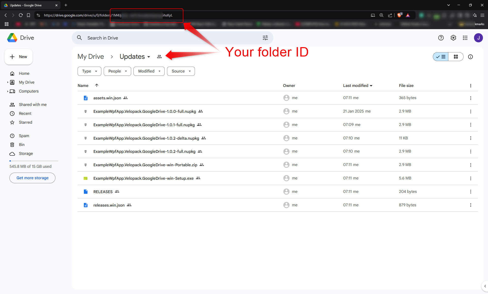
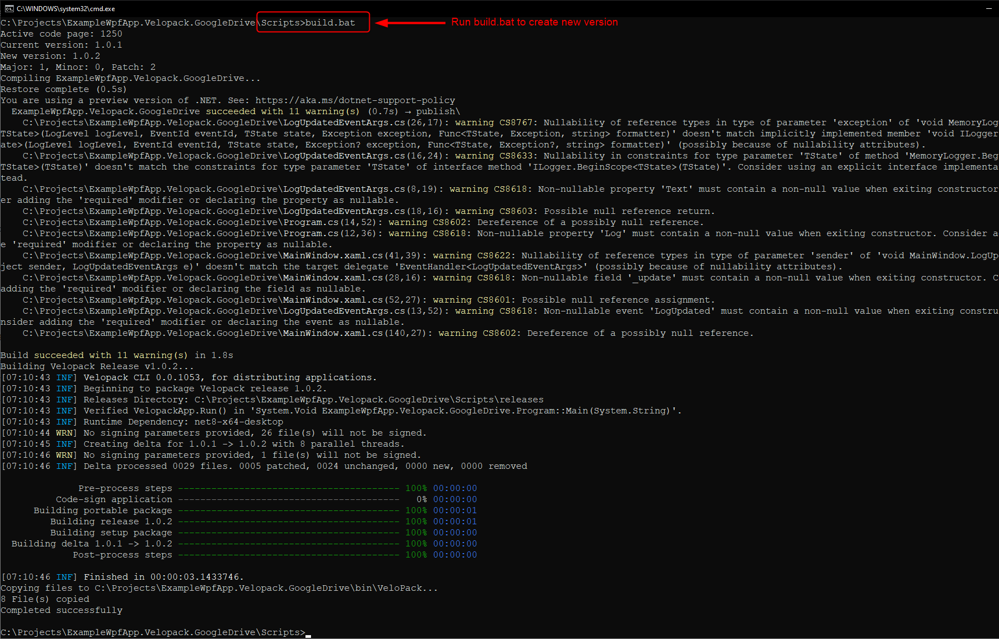

# ExampleWpfApp.Velopack.GoogleDrive

A sample WPF application demonstrating the use of **Velopack** together with Google Drive for managing application updates. The project is built on **.NET 8** and **C# 12.0**.






> **Original project** can be found in the VeloPack repository: [velopack/velopack - samples](https://github.com/velopack/velopack/tree/develop/samples)

---

## Prerequisites
- **.NET 8 SDK**
- **Visual Studio 2022** (or later)

---

## Project Structure
- **MainWindow.xaml.cs**  
  Contains the main logic for checking, downloading, and applying updates.
- **Program.cs**  
  The entry point of the application, initializes logging and Velopack configuration.
- **ExampleWpfApp.Velopack.GoogleDrive.csproj**  
  Project file containing dependencies and build settings.

---

## Short Instructions (Step by Step)

1. **Prepare a Google Drive account** with a publicly shared folder.
2. **Prepare an API key** for the selected account and folder (remember the folder ID).
3. **Fill in the details** in `MainWindow.xaml.cs`:
   ```csharp
   string folderId = "YOUR_FOLDER_ID"; // Your folder ID
   string apiKey = "YOUR_API_KEY";     // Your API key
   ```
4. **Use the script** `Scripts\build.bat` to build the project.
5. **Install** the application version from the locally generated `Scripts\releases` folder.
6. **Run the** `Scripts\build.bat` script again to create a new version (with a different program version number).
7. **Upload** all the files from the `Scripts\releases` folder to your folder on Google Drive.
8. **Run** the previously installed application on your computer and check if a new version is available (use the *Check for Updates* button).

---

## Getting Started

1. **Clone the repository**:
   ```bash
   git clone https://github.com/your-repo/ExampleWpfApp.Velopack.GoogleDrive.git
   cd ExampleWpfApp.Velopack.GoogleDrive
   ```
2. **Open the project**  
   Open `ExampleWpfApp.Velopack.GoogleDrive.sln` in Visual Studio 2022 (or later).
3. **Configure Google Drive API**  
   Replace the placeholder values in `MainWindow.xaml.cs`:
   ```csharp
   string folderId = "YOUR_FOLDER_ID"; // Your folder ID
   string apiKey = "YOUR_API_KEY";     // Your API key
   ```
4. **Build and Run** the project in Visual Studio.

---

## Usage

- **Check for Updates**  
  Click *Check for Updates* to see if a new version is available. The application will log the status and display it in the UI.
- **Download Update**  
  If an update is available, click *Download Update* to download the new version. The download progress will be shown in the UI.
- **Restart and Apply**  
  After the download is complete, click *Restart and Apply* to restart the application and install the update.

---

## Logging

The application uses `MemoryLogger` to record events and messages. Logs are displayed in the UI and can be used for debugging purposes.

---

## Dependencies
- [Google.Apis](https://www.nuget.org/packages/Google.Apis/)
- [Google.Apis.Drive.v3](https://www.nuget.org/packages/Google.Apis.Drive.v3/)
- [Google.Cloud.Storage.V1](https://www.nuget.org/packages/Google.Cloud.Storage.V1/)
- [Microsoft.Extensions.Logging](https://www.nuget.org/packages/Microsoft.Extensions.Logging/)
- [Velopack](https://www.nuget.org/packages/Velopack/)
- [VelopackExtension.GoogleDrive](https://www.nuget.org/packages/VelopackExtension.GoogleDrive/)

---

## License

This project is licensed under the [MIT](LICENSE) License.

---

## Contributing

Any suggestions, fixes, and improvements are welcome! Please open an issue or submit a pull request.

---

**Enjoy working with ExampleWpfApp.Velopack.GoogleDrive!**
